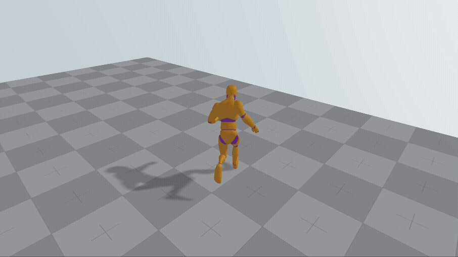

<h1 align="center">@react-three/viverse</h1>
<h3 align="center">Build 3D web games with threejs and viverse.</h3>
<br/>

<p align="center">
  <a href="https://npmjs.com/package/@react-three/viverse" target="_blank">
    
  </a>
  <a href="https://npmjs.com/package/@react-three/viverse" target="_blank">
    
  </a>
  <a href="https://twitter.com/pmndrs" target="_blank">
    
  </a>
  <a href="https://discord.gg/ZZjjNvJ" target="_blank">
    
  </a>
</p>

```bash
npm install three @react-three/fiber @react-three/viverse
```

### What does it look like?

| A prototype map with the simple character and its default model. |  |
| --------------------------------------------------------------------------- | --------------------------------------------------------------------- |

```jsx
import { createRoot } from 'react-dom/client'
import { Sky } from '@react-three/drei'
import { Canvas } from '@react-three/fiber'
import { Viverse, SimpleCharacter, FixedBvhPhysicsBody, PrototypeBox } from '@react-three/viverse'

createRoot(document.getElementById('root')!).render(
  <Canvas shadows>
    <Viverse>
      <Sky />
      <directionalLight intensity={1.2} position={[5, 10, 10]} castShadow />
      <ambientLight intensity={1} />
      <SimpleCharacter />
      <FixedBvhPhysicsBody>
        <PrototypeBox scale={[10, 1, 15]} position={[0, -0.5, 0]} />
      </FixedBvhPhysicsBody>
    </Viverse>
  </Canvas>,
)
```

## How to get started

> Some familiarity with
> react, threejs, and @react-three/fiber, is recommended.

Get started with **[building a simple game](https://docs.pmnd.rs/viverse/tutorials/simple-game)**, take a look at our **[examples](https://docs.pmnd.rs/viverse/getting-started/examples)**, or follow one of our **tutorials**:

- [First person controls](https://docs.pmnd.rs/viverse/tutorials/first-person)
- [Augmented and virtual reality](https://docs.pmnd.rs/viverse/tutorials/augmented-and-virtual-reality)
- [Accessing avatar and profile](https://docs.pmnd.rs/viverse/tutorials/access-avatar-and-profile)
- [Using custom animations and models](https://docs.pmnd.rs/viverse/tutorials/custom-models-and-animations)
- [How to remove the viverse integrations](https://docs.pmnd.rs/viverse/tutorials/remove-viverse-integrations)
- Building your own character controller - _Coming Soon_

## Not into react?

> No Problem

Check out how to build games using @pmndrs/viverse and only [vanilla three.js](https://docs.pmnd.rs/viverse/without-react).
